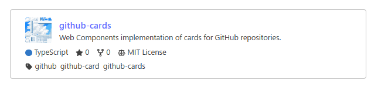

# GitHub Cards


A cutting-edge library designed to enhance the presentation of GitHub repositories and user profiles on your website. With minimal setup, you can embed dynamic, beautifully designed summaries of GitHub repositories that include key details such as descriptions, stars, forks, licenses, and topics. Built on modern [Web Components](https://developer.mozilla.org/en-US/docs/Web/API/Web_components) technology, this library is both easy to use and highly customizable.

## Features

- **Comprehensive Repository Information**: Display essential details like description, stars, forks, license, language, topics and user avatar.
- **Beautiful Design**: Out-of-the-box aesthetics that enhance the visual appeal of your website.
- **Easy Integration**: Simply include a `<script>` tag and use the custom element.
- **Customization**: Use CSS variables to customize the appearance and seamlessly integrate with your website's style.
- **Performance Optimization**: Caches responses from the GitHub API to avoid rate limits and uses the Cache API and Lock API to efficiently manage requests, even across sessions.

### Feature plans

- Implement a card for GitHub users to display user profiles with details such as follower count, repository count, and more.

## Demo




Check out this live demo to see GitHub Repo Cards in action:

https://tsukina-7mochi.github.io/github-cards/

## Usage

### CDN
 
You can import script from CDN `esm.sh`. Add the following `<script>` tag to your HTML document to load library:

```typescript
<script type="module" async src="https://esm.sh/@tsukina-7mochi/github-cards"></script>
```

Use the `<gh-repo-card>` custom element wherever you want to display a GitHub repository card:

```html
<gh-repo-card name="Tsukina-7mochi/github-cards></gh-repo-card>
```

See `docs` directory for demonstration page implementation.

### npm

You can simply import this library instead of loading from CDN:

```typescript
require('@tsukina-7mochi/github-cards`);
// or
import '@tsukina-7mochi/github-cards`;
```

### jsr

See https://jsr.io/@tsukina-7mochi/github-cards.

## API

### gh-repo-card

Attributes

| attribute        | description                                                   |
| ---------------- | ------------------------------------------------------------- |
| `name`           | Repository name e.g. `Tsukina-7mochi/github-cards` (required) |
| `no-avatar`      | Set true to hide user avatar                                  |
| `no-fork-source` | Set true to hide fork source                                  |
| `no-description` | Set true to hide repository description                       |
| `no-stars`       | Set true to hide stars count                                  |
| `no-forks`       | Set true to hide forks count                                  |
| `no-license`     | Set true to hide license                                      |
| `no-language`    | Set true to hide language                                     |
| `no-topics`      | Set true to hide topics                                       |

## Thanks

- [tarptaeya/repo-card](https://github.com/tarptaeya/repo-card) for reference the specification and design.
- [ozh/github-colors](https://github.com/ozh/github-colors) for providing language colors.
